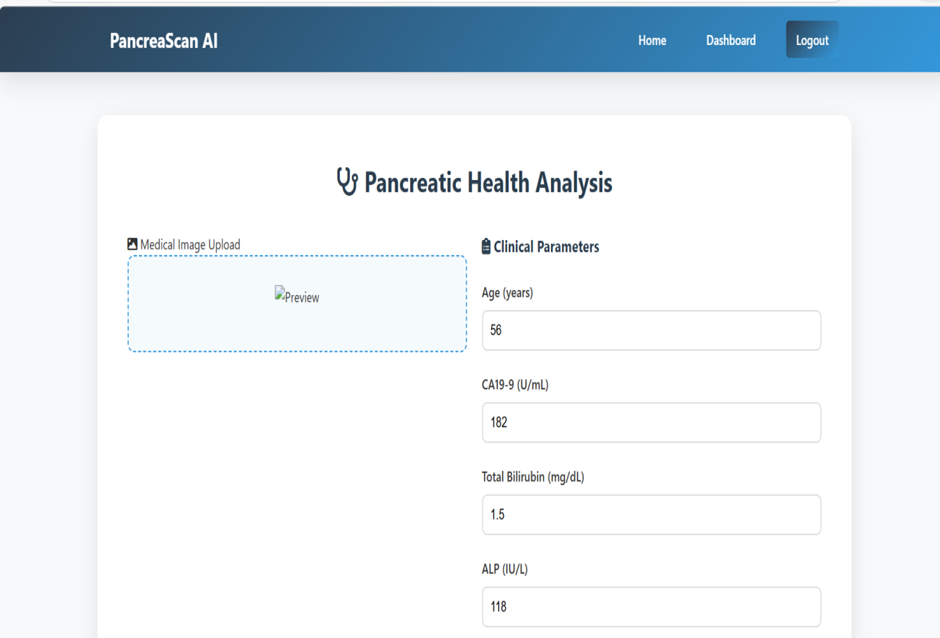
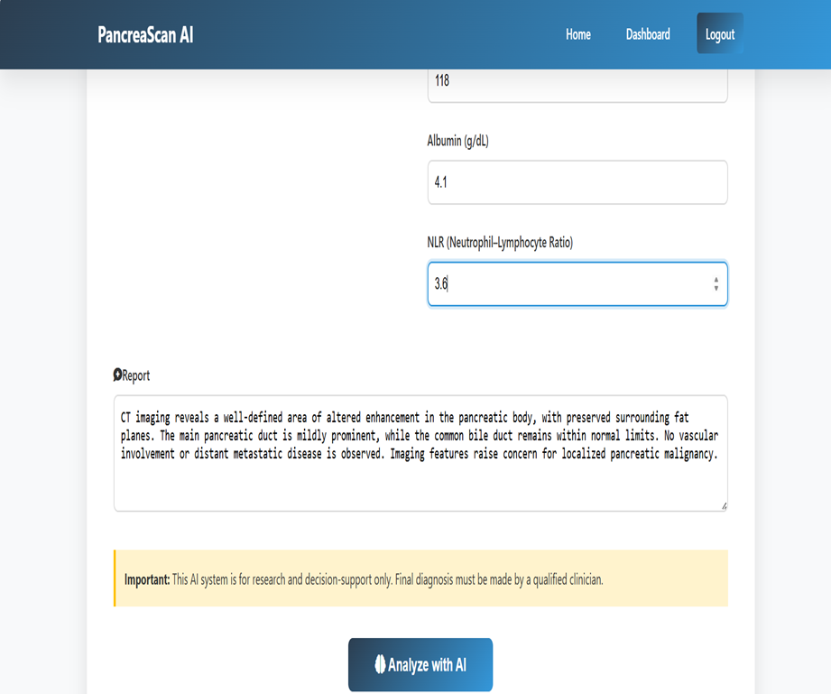
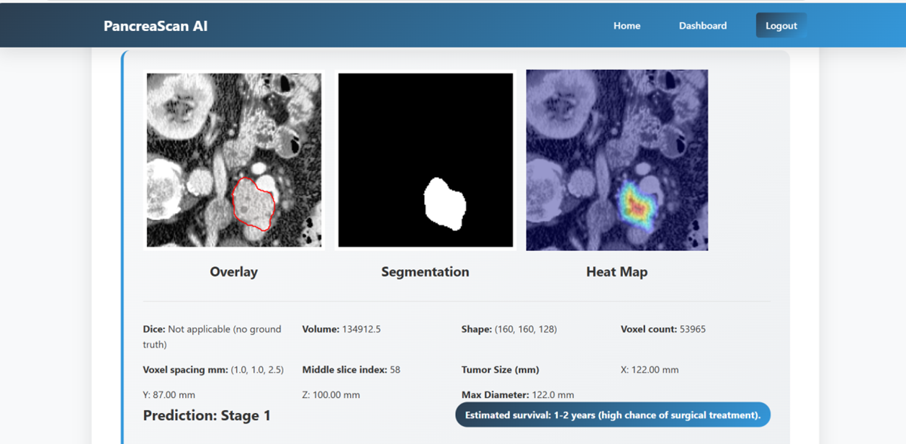
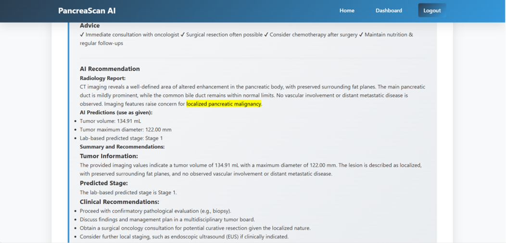
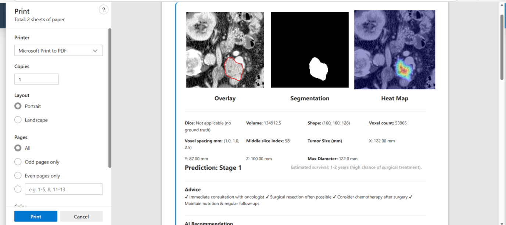

# 🧠 Prediction and Detection of Pancreatic Cancer using Explainable Multimodal AI

## 📌 Overview

Pancreatic cancer is one of the most lethal cancers due to late detection and complex clinical evaluation. This project presents an **AI-powered clinical decision support system** that combines **medical imaging, laboratory biomarkers, and radiology reports** to assist in early detection, staging, and prognosis estimation.

The system is designed to provide **accurate predictions along with explainable outputs**, enabling clinicians to understand the reasoning behind AI decisions.

---

## 🚀 Key Features

### 🖼 Imaging Analysis (CT Scan)

* Tumor detection and segmentation using **nnU-Net**
* Automatic identification of tumor region
* Overlay visualization on CT slices

### 📊 Tumor Quantification

* Tumor volume calculation (mm³)
* Tumor dimensions (X, Y, Z)
* Maximum tumor diameter estimation

### 🧪 Lab-Based Prediction

* Uses clinical biomarkers:

  * CA19-9
  * Total Bilirubin
  * ALP
  * Albumin
  * NLR
  * Age
* Predicts cancer stage using ML model

### 📈 Survival Estimation

* Personalized survival prediction based on risk score
* Combines stage + lab values

### 🤖 Explainable AI (XAI)

* Heatmaps showing tumor attention
* Highlighted radiology report phrases
* AI-generated clinical summary

---
## 📸 Demo

### Input Image





### Output (Segmentation / Prediction)


### 🔥 Explainable AI Heatmap
Highlights important regions used for prediction.






## 📊 Dataset

### 🖼 Imaging Data

The imaging dataset is obtained from the **Medical Segmentation Decathlon (MSD) Pancreas dataset**.
The dataset consists of abdominal CT scans in **NIfTI (.nii.gz) format**, which are widely used in medical imaging.

These images are used for:

* Tumor detection
* Tumor segmentation using nnU-Net
* Extraction of tumor volume and size

---

### 🧪 Laboratory Data

Laboratory data was derived based on analysis of the **MIMIC-IV clinical dataset**.
Access to MIMIC-IV was obtained after completing the required Data Use Agreement (DUA).

From the dataset, relevant clinical biomarkers associated with pancreatic cancer progression were studied.
Based on literature and clinical relevance, the following features were selected:

* CA19-9
* Total Bilirubin
* Alkaline Phosphatase (ALP)
* Albumin
* Neutrophil-to-Lymphocyte Ratio (NLR)
* Age

Due to limitations in directly using patient-level labeled data, a **synthetic dataset** was generated that reflects realistic clinical ranges and stage labels.

---

### 📄 Radiology Reports

Radiology report text is provided as user input and analyzed using a Large Language Model (Gemini API) to extract relevant clinical insights and generate explainable summaries.

---

### ⚠️ Note

* Imaging data is sourced from publicly available datasets (MSD)
* Clinical data is based on MIMIC-IV analysis, with synthetic generation for modeling
* No real patient-identifiable data is used in this project


### System Architecture

The proposed system follows a multi-layered architecture integrating imaging, clinical, and textual data for pancreatic cancer detection and prognosis.

1. **Presentation Layer**

   * CT Images
   * Radiology Reports
   * Laboratory Parameters
   * Visualization Interface

2. **AI Model Layer**

   * nnU-Net for Tumor Segmentation
   * Tumor Detection and Localization
   * Feature Extraction (Volume, Size)

3. **Service Layer**

   * Image Preprocessing
   * Tumor Volume Calculation
   * Lab-based Stage Prediction Model
   * Radiology Text Analysis (LLM - Gemini API)
   * Survival Estimation

4. **Decision Layer**

   * Tumor Presence Classification
   * Stage Prediction
   * Multimodal Feature Fusion
   * Prognosis Estimation
   * Clinical Recommendation

5. **Explainable Output Layer**

   * Grad-CAM Heatmaps for Imaging
   * Highlighted Radiology Text
   * Lab Value Trends
   * Final Explainable Report


---

## 📂 Project Structure

```
Pancreatic-Cancer-AI/
│
├── app.py                  # Main Flask application
├── Analyzer.py             # Imaging pipeline (nnU-Net inference)
├── lab_prediction.py       # Lab-based stage prediction
├── database.py             # Database setup (SQLite)
├── models.py               # User model
├── templates/              # HTML frontend
├── static/                # Uploads and output images
│   ├── uploads/
│   └── output_case/
├── requirements.txt        # Dependencies
├── README.md               # Project documentation
```

---

## 🛠 Tech Stack

* **Backend:** Python, Flask
* **Deep Learning:** PyTorch, nnU-Net
* **Image Processing:** OpenCV, Nibabel, NumPy
* **Database:** SQLite
* **NLP:** Google Gemini API
* **Visualization:** Matplotlib

---

## ▶️ Installation & Setup

### 1. Clone Repository

```
git clone https://github.com/your-username/Pancreatic-Cancer-AI.git
cd Pancreatic-Cancer-AI
```

### 2. Install Dependencies

```
pip install -r requirements.txt
```

### 3. Set Environment Variable

For Gemini API:

```
set GEMINI_API_KEY=your_api_key
```

### 4. Configure nnU-Net Paths

Update paths in `Analyzer.py`:

```
nnUNet_raw
nnUNet_preprocessed
nnUNet_results
```

### 5. Run Application

```
python app.py
```

### 6. Open in Browser

```
http://127.0.0.1:5000
```

---

## 📊 Outputs

* Tumor segmentation image
* Overlay visualization
* Heatmap (XAI)
* Tumor volume & size
* Predicted cancer stage
* Survival estimation
* AI-generated clinical explanation

---

## ⚠️ Important Notes

* Datasets and trained models are **not included** due to size and privacy constraints
* Synthetic dataset is used for lab-based predictions
* Users must configure nnU-Net environment locally

---

## 🎯 Applications

* Clinical decision support systems
* Radiology assistance tools
* Early cancer detection research
* Explainable AI in healthcare

---

## 🔮 Future Work

* Integration with hospital PACS systems
* Real-time inference optimization
* Multi-institutional dataset validation
* Deployment as web/cloud service

---

## 👩‍💻 Author

**Rakshitha C**

---

## 📜 License

This project is intended for **academic and research purposes only**.


